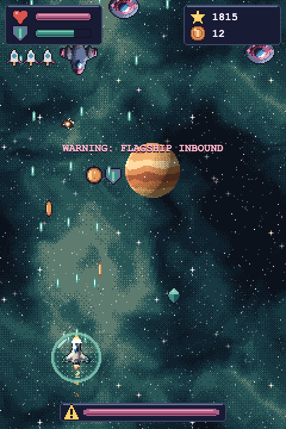

# Cozy Space Run

A small arcade space shooter that runs in the browser: dodge plasma, grab coins and crystals, power up to a triple shot and take down the flagship that shows up every minute or so.
Plain JavaScript in one HTML file (canvas, no engine, no build step).

**▶ Play it:** [aquumgifts.github.io/cozy-space-run](https://aquumgifts.github.io/cozy-space-run/) · also on [itch.io](https://aquumgifts.itch.io/cozy-space-run)

## How to play

- Move: arrow keys or WASD, or drag anywhere on the screen (works on phones). Fire is automatic.
- Crystal: stronger shot (up to 3 levels) · Shield icon: 10 s bubble · Heart: +1 life
- P or Esc to pause, M to mute

## Made only from free asset packs

Every sprite, background, effect and sound comes from the free [Cozy Space set](https://itch.io/c/8266575), which you can use in your own games (commercial use allowed):
[Ships](https://aquumgifts.itch.io/cozy-space-ships) (player ship, enemies, lasers, explosions),
[Backdrops](https://aquumgifts.itch.io/cozy-space-backdrops) (parallax stars, nebulas, planets),
[FX](https://aquumgifts.itch.io/cozy-space-fx), [Icons & UI](https://aquumgifts.itch.io/cozy-space-icons-ui),
[Pixel Font](https://aquumgifts.itch.io/cozy-space-pixel-font), [Music](https://aquumgifts.itch.io/cozy-space-music) and [SFX](https://aquumgifts.itch.io/cozy-space-sfx).
Everything in one download: [Cozy Space Complete](https://aquumgifts.itch.io/cozy-space-complete).

Run it locally with any static server (`python3 -m http.server 8000`).

## License

Code: MIT (see [LICENSE](LICENSE); comments are in Spanish). Assets: Cozy Space set by Bramble & Byte, free to use in your games; don't resell the assets on their own.
The art is drawn in code and the music and sounds are synthesized with our own code: no AI image, music or sound generators.
